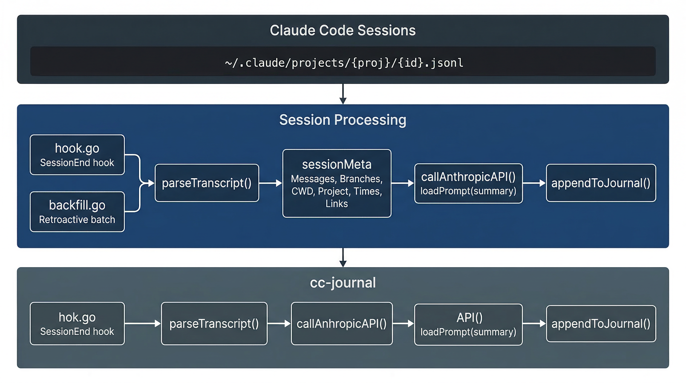

# Architecture

## System Overview

  

## Session Processing

  

## Customization Layers

  

## Source Files

| File | Purpose |
|------|---------|
| `main.go` | CLI entry point, command dispatch, flag parsing |
| `config.go` | YAML config loading, defaults, env var overrides |
| `hook.go` | SessionEnd hook — reads JSON stdin, orchestrates summarization |
| `summarize.go` | Transcript parsing, Anthropic API calls, journal writing |
| `backfill.go` | Retroactive summarization of recent sessions |
| `journal.go` | Parse journal markdown files into entries, dashboard computation |
| `status.go` | Report generation (standup/weekly), template execution |
| `browse.go` | CLI browse commands (today, show, list, week, rollup) |
| `server.go` | HTTP server, static site builder, template rendering |
| `links.go` | URL classification, issue key extraction, external link handling |
| `init.go` | Export builtin prompts and templates for customization |
| `prune.go` | Remove failed summary entries |
| `deny.go` | Session deny-list management |

## Key Types

| Type | Purpose |
|------|---------|
| `TokenUsage` | Token counts — input, output, cache create, cache read, summary in/out |
| `Entry` | Parsed journal entry — date, project, branch, time range, summary, links, tokens |
| `sessionMeta` | Parsed JSONL transcript — messages, branches, CWD, project, times, links, tokens |
| `JournalData` | All entries + daily files + project counts |
| `DashboardData` | Stats, heatmap, activity bars, recent entries |
| `StandupData` / `WeeklyData` | Pre-computed report data for templates |
| `ReportGroup` | Project group with branches, duration, session count, done bullets, tokens in/out |
| `SummarySections` | Extracted ### Done / Decisions / Open from AI summaries |
| `ExternalLink` | Classified URL — service, label, URL |
| `Config` | Runtime configuration — journal dir, model, API key, Slack, links |

## External Integrations

| Integration | Purpose | Mechanism |
|-------------|---------|-----------|
| **Anthropic API** | Session summarization, rollup generation | HTTP POST to `/v1/messages` |
| **Claude Code** | Source transcripts + token usage | Reads `~/.claude/projects/` JSONL files, extracts usage from assistant messages |
| **Slack** | Report delivery | Configurable command exec |
| **Clipboard** | Report copying | pbcopy (macOS) / xclip / xsel (Linux) |
| **GitHub/Linear/Jira/Confluence** | Link extraction | URL pattern matching from transcripts |
