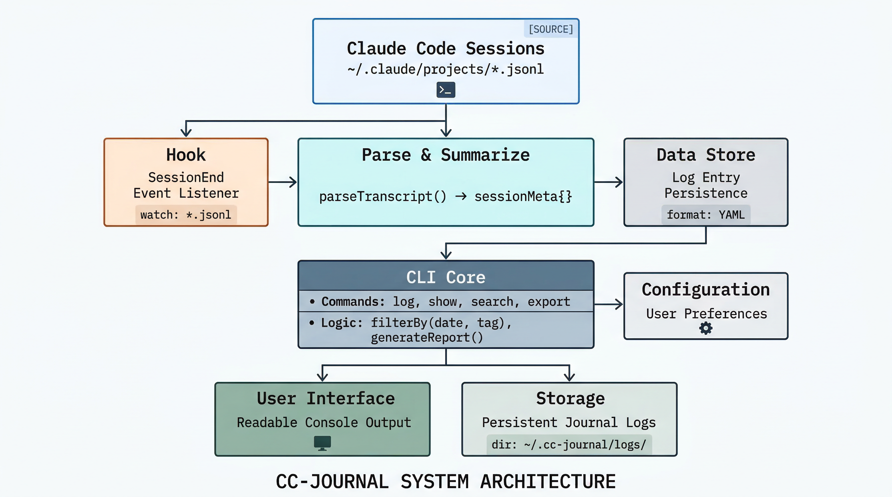

# cc-journal

A single Go binary that captures, summarizes, and visualizes your Claude Code sessions as a developer journal.

<p align="center">
  
</p>

```
Claude Code session ends
  → SessionEnd hook reads transcript JSONL
  → Calls Anthropic API for AI summary
  → Appends to ~/claude-journal/YYYY-MM-DD.md
  → cc-journal serves a dashboard or generates static HTML
```

## Install

### From release

Download the latest binary from [Releases](https://github.com/natefaerber/cc-journal/releases) and place it in your PATH:

```sh
# macOS (Apple Silicon)
curl -sL https://github.com/natefaerber/cc-journal/releases/latest/download/cc-journal_darwin_arm64.tar.gz | tar xz
mv cc-journal ~/.local/bin/

# macOS (Intel)
curl -sL https://github.com/natefaerber/cc-journal/releases/latest/download/cc-journal_darwin_amd64.tar.gz | tar xz
mv cc-journal ~/.local/bin/

# Linux (amd64)
curl -sL https://github.com/natefaerber/cc-journal/releases/latest/download/cc-journal_linux_amd64.tar.gz | tar xz
mv cc-journal ~/.local/bin/
```

### With mise

```sh
mise use -g github:natefaerber/cc-journal
```

### From source

```sh
go install github.com/natefaerber/cc-journal@latest
```

Or build locally:

```sh
git clone https://github.com/natefaerber/cc-journal.git
cd cc-journal
go build -o cc-journal .
```

## Setup

### 1. API key

cc-journal checks for an API key in this order:

1. [fnox](https://github.com/multitheftauto/fnox) encrypted key store
2. `CC_JOURNAL_API_KEY` environment variable
3. `ANTHROPIC_API_KEY` environment variable
4. `api_key` in config.yaml

```sh
# Option A: fnox (recommended)
fnox set ANTHROPIC_API_KEY

# Option B: dedicated env var
export CC_JOURNAL_API_KEY=sk-ant-...

# Option C: shared env var
export ANTHROPIC_API_KEY=sk-ant-...
```

### 2. SessionEnd hook

Add to `~/.claude/settings.json`:

```json
{
  "hooks": {
    "SessionEnd": [
      {
        "hooks": [
          {
            "type": "command",
            "command": "TMP=$(mktemp /tmp/cc-journal-in.XXXXXX); cat > \"$TMP\"; ( cc-journal hook < \"$TMP\" >/tmp/cc-journal.log 2>&1; rm -f \"$TMP\" ) &",
            "timeout": 1
          }
        ]
      }
    ]
  }
}
```

The hook captures stdin synchronously, then backgrounds the API call so it doesn't block session exit.

### 3. Verify

End a Claude Code session, then check:

```sh
cc-journal today
```

## Commands

### Site

<p align="center">
  
</p>

```sh
cc-journal serve [--port 8000] [--templates DIR]   # Dev server with live data
cc-journal build [--out public] [--templates DIR]   # Static HTML generation
```

Send `kill -HUP` to the serve process to reload `config.yaml` without restarting. Templates reload from disk on each request automatically.

Routes:

| Route | Description |
|-------|-------------|
| `/` | Dashboard — stats, activity chart, heatmap, projects, recent sessions |
| `/daily` | Date index with session counts, time spans, and project names |
| `/daily/YYYY-MM-DD` | Single day view with session navigation |
| `/project/NAME` | All sessions for a project |
| `/standup` | Daily standup report |
| `/weekly` | Weekly status report |
| `/api/palette` | JSON endpoint for command palette data |

### Journal

```sh
cc-journal hook                              # SessionEnd hook (reads JSON from stdin)
cc-journal summarize [SESSION_ID] [--force]  # On-demand summary
cc-journal backfill [--days 30] [--dry-run]  # Retroactively summarize old sessions
cc-journal prune [--dry-run]                 # Remove failed summary entries
cc-journal remove SESSION_ID                 # Delete entry + deny from future backfills
```

### Browse

```sh
cc-journal today                       # Print today's entries
cc-journal show YYYY-MM-DD             # Print a specific date
cc-journal list                        # List all journal files
cc-journal week [DATE] [--rollup]      # This week's entries or AI rollup
cc-journal rollup [DATE]               # Generate AI weekly rollup
```

### Reports

```sh
cc-journal standup [DATE] [--copy] [--slack [CHANNEL]]          # Daily standup (default: today)
cc-journal weekly  [START] [--end END] [--copy] [--slack [CHANNEL]]  # Weekly status (default: this week)
```

`--copy` copies to clipboard. `--slack` sends to Slack (channel overrides config default).

### Customization

```sh
cc-journal init                                 # Export templates + prompts to filesystem
cc-journal init --templates                     # Export templates only
cc-journal init --prompts                       # Export prompts only
cc-journal init --force                         # Overwrite existing files
cc-journal init --stdout                        # Print to stdout instead of writing files
cc-journal init --templates --stdout            # Print templates to stdout
```

## Keyboard navigation

The web UI supports full keyboard navigation:

| Key | Context | Action |
|-----|---------|--------|
| `Cmd+K` / `Ctrl+K` | Global | Open command palette |
| `j` / `k` | Daily pages | Navigate between sessions or dates |
| `[` / `]` | Daily entry | Previous / next day |
| `y` | Focused session | Copy permalink |
| `r` | Focused session | Copy `claude --resume` command |
| `x` | Focused session | Delete entry |
| `g` / `G` | Global | Scroll to top / bottom |
| `h` / `l` | Global | Browser back / forward |
| `Enter` | Daily list / palette | Open selected item |
| `Escape` | Global | Close palette, clear focus |
| `↑` / `↓` | Palette | Navigate results |

The command palette searches across all pages, projects, dates, and recent sessions.

## Journal format

Each `~/claude-journal/YYYY-MM-DD.md` file:

```markdown
# Claude Code Journal — 2026-03-10

---

## my-project (main) — 14:00–15:30

### Done
- Built the auth module

### Decisions
- Chose JWT over session cookies

### Open
- Need to add refresh token logic

<details>
<summary>Session ID</summary>
<code>abc123-...</code>
<code>/path/to/project</code>
<code>tokens:in=161,out=20308,cache_create=251602,cache_read=7955592,summary_in=1500,summary_out=512</code>
</details>
```

Token usage (input, output, cache create, cache read) is parsed from Claude Code JSONL transcripts. Summarizer API tokens are tracked separately. Old entries without token data display as zero.

Weekly rollups are saved as `~/claude-journal/YYYY-WXX-rollup.md`.

## Configuration

All settings live in `$XDG_CONFIG_HOME/cc-journal/config.yaml` (defaults to `~/.config/cc-journal/config.yaml`):

```yaml
# Directory containing daily journal markdown files.
# Default: ~/claude-journal
journal_dir: ~/claude-journal

# Directory containing custom prompt templates.
# Default: ~/.config/cc-journal/prompts
prompt_dir: ~/.config/cc-journal/prompts

# Anthropic model for summarization.
# Default: claude-sonnet-4-20250514
model: claude-sonnet-4-20250514

# API key (prefer fnox or CC_JOURNAL_API_KEY env var instead).
# api_key: sk-ant-...

# First day of the week for reports and dashboard.
# Default: monday
week_start: monday

# Directories to exclude from journal summarization.
exclude:
  - ~/private-project

# Slack integration for report commands.
slack:
  command: /path/to/slack-cli
  channel: "#standup"

# Auto-linking for issue trackers, PRs, and wikis.
links:
  issues:
    LPE: https://linear.app/myorg/issue
    PROJ: https://myorg.atlassian.net/browse
  confluence: https://myorg.atlassian.net/wiki
  github_repos:
    - myorg/main-repo
    - myorg/other-repo
```

Environment variables override config file values:

| Variable | Overrides | Description |
|----------|-----------|-------------|
| `JOURNAL_DIR` | `journal_dir` | Journal file directory |
| `CC_JOURNAL_API_KEY` | `api_key` | Dedicated API key for cc-journal |
| `ANTHROPIC_API_KEY` | `api_key` | Shared Anthropic API key (lower priority) |

## Template customization

Templates are embedded in the binary but can be overridden at runtime:

```sh
# Export defaults as a starting point
cc-journal init --templates

# Or preview without writing files
cc-journal init --templates --stdout

# Edit, then serve with overrides
cc-journal serve --templates ~/.config/cc-journal/templates
```

Templates use [Tailwind CSS v4](https://tailwindcss.com/) (CDN) and [Source Serif 4](https://fonts.google.com/specimen/Source+Serif+4) for a warm, notebook-inspired theme.

| Variable | Default | Description |
|----------|---------|-------------|
| `--color-background` | `#f5f0e8` | Cream page background |
| `--color-foreground` | `#1a1a1a` | Primary text |
| `--color-card` | `#fffdf7` | Card background |
| `--color-accent` | `#2563eb` | Blue accent |
| `--color-secondary` | `#7c3aed` | Purple secondary |

## Prompt customization

All AI and report prompts can be customized per-installation:

```sh
# Export all default prompts
cc-journal init --prompts

# Edit any prompt in ~/.config/cc-journal/prompts/
```

| Prompt | Purpose | Template Variables |
|--------|---------|-------------------|
| `summary.txt` | Session summarization (Anthropic API) | `{{.Project}}`, `{{.Branch}}`, `{{.Transcript}}` |
| `rollup.txt` | Weekly rollup generation (Anthropic API) | `{{.Week}}`, `{{.Content}}` |
| `standup.txt` | Daily standup report format (Go text/template) | `.DateLabel`, `.YesterdayGroups`, `.TodayGroups`, `.OpenItems`, `.Links` |
| `weekly.txt` | Weekly status report format (Go text/template) | `.WeekLabel`, `.Groups`, `.Decisions`, `.OpenItems`, `.Links`, `.TotalSessions`, `.TotalProjects`, `.ActiveDays`, `.TotalTokensIn`, `.TotalTokensOut` |

Report templates (`standup.txt`, `weekly.txt`) use Go's `text/template` syntax with full access to loops, conditionals, and the pre-computed data structs.

## Project structure

```
.
├── main.go              # CLI entry point + command dispatch
├── config.go            # Config loading (XDG_CONFIG_HOME/cc-journal/config.yaml)
├── server.go            # HTTP server, static builder, template loading
├── journal.go           # Journal parsing, stats, dashboard data
├── summarize.go         # Transcript parsing, Anthropic API, prompt loading
├── hook.go              # SessionEnd hook handler
├── backfill.go          # Retroactive session summarization
├── browse.go            # today/show/list/week/rollup commands
├── status.go            # Standup + weekly report formatters
├── links.go             # Auto-linking (issues, PRs, Confluence)
├── deny.go              # Session deny list management
├── prune.go             # Failed entry cleanup
├── init.go              # Template/prompt export (init command)
├── templates/
│   ├── base.html        # Layout, nav, command palette, keyboard nav
│   ├── dashboard.html   # Stats, bar chart, heatmap, projects, recent sessions
│   ├── daily-list.html  # Date index with session counts
│   ├── daily-entry.html # Single day with session focus/nav
│   ├── project.html     # Per-project session list
│   └── report.html      # Standup/weekly report display
├── docs/
│   └── spec-menubar.md  # Menu bar app spec
├── .github/
│   └── workflows/
│       ├── ci.yaml      # Build + test + lint on push/PR
│       └── release.yaml # GoReleaser on tag push
├── .goreleaser.yaml     # Cross-platform binary builds
├── install.sh           # Local build + install script
├── go.mod
└── go.sum
```

## Development

```sh
go build -o cc-journal .
go test -v -race ./...
go vet ./...
```

Local install with version info:

```sh
./install.sh
```

### Releasing

Tag a version to trigger the release workflow:

```sh
git tag v0.1.0
git push origin v0.1.0
```

GoReleaser builds binaries for linux/darwin on amd64/arm64 and creates a GitHub release with checksums.

## Dependencies

- **Go 1.24+**
- **[goldmark](https://github.com/yuin/goldmark)** — markdown rendering (+ table extension)
- **[gopkg.in/yaml.v3](https://pkg.go.dev/gopkg.in/yaml.v3)** — config file parsing
- **[Tailwind CSS v4](https://tailwindcss.com/)** — styling (CDN, no build step)
- **[fnox](https://github.com/multitheftauto/fnox)** — secret management (optional)

## Troubleshooting

**Hook not firing?** Ensure `~/.claude/settings.json` has the `SessionEnd` hook (not `Stop` — `Stop` fires after every response). Check `/tmp/cc-journal.log`.

**401 Unauthorized?** Run `cc-journal debug-key` to diagnose. The key priority is: fnox → `CC_JOURNAL_API_KEY` → `ANTHROPIC_API_KEY` → config file. A stale env var can shadow a valid fnox key.

**Template depth errors?** Page templates must not contain `{{template "base" .}}` — the binary calls `ExecuteTemplate("base", data)` directly.

**Backfill skipping sessions?** Sessions on the deny list (via `cc-journal remove`) are permanently excluded. Run `cc-journal backfill --dry-run` to preview what would be processed.
